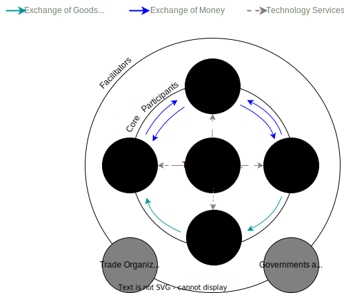

---

copyright:
  years: 2021, 2023
lastupdated: "2024-10-31"

subcollection: connected-trade-platform

keywords: trade finance connected trade platform ibm cloud fintech

---

{{site.data.keyword.attribute-definition-list}}

# IBM Connected Trade Platform to power the digitization of trade and supply chain financing
{: #trade-platform-finance}
{: #white-paper}

This white paper introduces and provides an overview of the trade finance industry, its market potential, and current challenges. In addition, IBM's proposed solution to address those challenges and how the solution can accelerate the modernization and digitization of the trade finance industry is discussed.
{: shortdesc}

## Understanding trade finance
{: #trade-finance-overview}

Trade finance represents financial products and services that facilitate domestic and international trade activities between buyers and sellers aiming to mitigate performance and payment risks while improving cash flows. This is a global industry with a diverse ecosystem of participants such as:

- Buyers
- Suppliers
- Logistics firms
- Financial service providers
- Government Entities dealing with tax collection, border security, and regulatory aspects
- International organizations:
    - World Customs Organization
    - International Chamber of Commerce
    - United Nations

The following diagram captures the trade finance ecosystem participants.

{: caption="Trade Finance Ecosystem Participants" caption-side="bottom"}

A trade transaction requires a seller of goods and services and a buyer. Various intermediaries such as banks and other financial institutions can facilitate these transactions by financing the trade. There is a diverse set of products being offered to serve the needs of the counter-parties in the transaction in the form of letters of credit (LOC), guarantees, or insurance. However, due to the very fragmented and distributed nature of the trade ecosystem, technology adoption has been lagging in comparison to other industries.

## Trade finance market
{: #trade-finance-market}

The global trade finance market size was evaluated at $10.52 trillion in 2023 and is slated to hit $13.66 trillion by the end of 2032 with a CAGR of nearly 2.94% between 2024 and 2032.

{: caption="Trade Finance Market" caption-side="bottom"}

### Key Takeaways
{: #key-takeaways}

- Trade finance supports 80% of global trade.
- Trade finance revenues of $6.6B for top 10 banks.
- The financing gap is growing to ~$2T in unmet demand.
- There have been $56.1 billion in regulatory fines since the financial crash.
- There are 4B documents circulating in the trade system.

## Trade finance challenges and opportunities
{: #trade-finance-challenges-opportunities}

Today, we are seeing significant digital disruption in the business of trade and supply chain financing that is largely influenced by global events and geopolitics, changing regulations, compliance and control requirements, advancements in technology and innovation, and access to capital.

When examining these disruptors more closely, it’s clear there are a wide variety of factors that can impact global trade and supply chain financing. These can range all the way from elevated inflation, which has the potential to cause margin pressures, to geopolitics, which can impact globalization and force changes towards friend shoring and near shoring. At the same time, complex and fragmented supply chains can introduce challenges like supply chain compliance and fraud mitigation. Supplier visibility and traceability is growing in importance to help achieve environmental, social, and governance (ESG) targets.

Lets take a deeper look at some of the friction points:

- Setup and documentation
    - Unpredictable mix of manual and machine documents 
    - Varying documents and formats 
    - Exception processing is labor-driven
- Credit Analysis
    - Errors due to manual workflow data completeness and data inaccuracy
    - Bank foregoes funding credit-worthy suppliers because of manual workflow data completeness errors and data inaccuracy
- Commercial and compliance checks
    - Research and verification of documents is time-consuming 
    - Forgery and fraud risks are difficult to eliminate 
- Transaction processing
    - Inefficiency from re-keying data to gain multiple bank departmental approvals
- Fulfillment
    - Manual processes and fragmented systems increase time, coordination, and cost in releasing funds
- Post-fulfillment
    - Lack of data to support regulatory reporting, tracking, discrepancy analysis 

These are just a few of the many key factors we see driving transformational change within trade and supply chain processes.

### Transitioning from a fragmented to a data-driven supply chain
{: #data-driven-supply-chain}

In the past, it was common to see manual, paper-intensive trade processes that have the potential to generate large amounts of data. However, this data can often become trapped in silos and cause complexities, resulting in delays and increased costs. With the increasing demands of global trade, organizations are starting to embrace digitization, standardization, and collaboration to accelerate time to value and reduce costs.

Technology is playing an important role in reprogramming the DNA of trade and supply chain financing. It can help connect disparate and disconnected manual processes and platforms to a data-driven and connected trade ecosystem. Siloed processes can become integrated by using intelligent workflows, which help enable seamless and automated exchange of financial, informational and physical supply chain data in one distributed network.

With these capabilities, a single source of truth can then be established across all parties, helping to increase trust between trading parties. This approach can provide users with new and more efficient ways of conducting and financing global trade.

## Proposed solution for IBM Connected Trade Platform
{: #proposed-solution-ctp}

Digitization, along with standardization and collaboration within the industry can help create a variety of benefits. For example, banks gain real-time visibility into their respective supply chains, eliminate paper-based processes and associated manual labor, improve speed to working capital optimization, enhance cash-flow forecasting accuracy, safeguard transactions against cybersecurity risk, enable greater supply chain resiliency, and unlock wider procure-to-pay benefits.

At IBM, we recognize that this transformation requires adopting a platform strategy that lifts the supporting ecosystem, and we aim to deliver this using next-generation ‘as a Service’ business model. As organizations look to modernize their trade finance journeys, we use the breadth of IBM’s technology and consulting capabilities to develop a Connected Trade Platform for the industry. As part of our approach, we are sourcing digitally native business-process capabilities from multiple fintechs, given that no two banks are likely going to have the same set of applications or processes.

Our platform strategy is designed to build secured infrastructure that is optimized for regulated business processes and help support clients in their compliance journeys. It is also abstracted at a common infrastructure control plane that aims to make it easy for banks to adopt and consume. With a plug-and-play integration framework for banking-specific backend systems, the platform can help enable the flow of financial transactions from the front office to the back office.

At IBM, we believe it’s critical that this industry-specific platform is optimized to enable growth and remove risk trade for all the participants in the ecosystem:

- From a bank’s perspective, this can mean reduced time to market, elimination of fragmented and manual processes, and conformity to an individual bank’s security and compliance standards.
- From a buyer’s perspective, it can drive significant improvement in working capital, superior supplier performance and accelerated ESG initiatives.
- From a fintech's perspective, it can reduce the barrier to adoption, enable an expanded go-to-market reach, deliver flexible integration with a bank’s backend systems and allow for simplified operations management of their respective applications.

{: caption="IBM Connected Trade Platform Functional View" caption-side="bottom"}

## Logical architecture
{: #logical-architecture}

The following figure and conceptual elements depict the logical architecture of the IBM Connected Trade Platform.

{: caption="Logical Architecture" caption-side="bottom"}

### Conceptual elements
{: #logical-architecture-conceptual-elements}

#### IBM hybrid cloud
{: #logical-architecture-ibm-hybrid-cloud}

The platform is built on IBM’s hybrid cloud. {{site.data.keyword.cloud_notm}} offers 246+ public cloud solutions as services or software. {{site.data.keyword.cloud_notm}} is designed keeping in mind the most regulated of industries and is differentiated in its performance, resiliency, security, and TCO. {{site.data.keyword.cloud_notm}} is available in 10 multizone regions, including 30 data centers, across the world along with 29 single data centers. For more information, see [IBM Hybrid Cloud](https://cloud.ibm.com/){: external}.

#### Network layer
{: #logical-architecture-network-layer}

The network utilizes the virtual private cloud design, which as the name suggests is a virtual network that is logically isolated from other {{site.data.keyword.cloud_notm}} tenants. VPC lets you create a fully customizable, software-defined virtual network with superior isolation. {{site.data.keyword.cloud_notm}} Virtual Private Cloud provides custom network topologies, flexible subnet sizes, and enhanced security. Hybrid network connectivity with bank systems can be achieved using VPN and direct link connect and direct link dedicated offerings. For more information, see [Getting started with VPC](/docs/vpc?topic=vpc-getting-started).

#### Storage Layer
{: #logical-architecture-storage-layer}

The storage layer provides multiple options to choose from.

* **File Storage:** 
The {{site.data.keyword.cloud_notm}} File Storage for VPC service provides secure, persistent, NSFv4.1 protocol-based file storage. {{site.data.keyword.cloud_notm}} File Storage for VPC is backed by All-Flash architecture. You can create file shares with capacity that ranges from 10 GB to 32 TB with flexible options.

* * [**Object Storage:**](/docs/cloud-object-storage?topic=cloud-object-storage-getting-started-cloud-object-storage)
IBM Cloud Object Storage is a highly scalable cloud storage service, designed for high durability, resiliency, and security. Store, manage, and access your data by using the self-service portal and RESTful APIs. 

* **Block Storage:**
Get local disk performance with SAN persistence and durability. Increase storage capacity available to your {{site.data.keyword.BluVirtServers}} with a maximum of 48k IOPS. Deploy flash-backed block storage volumes from 20GB to 16TB and customize it with a variety of capabilities. For more information, see [VPC storage services overview](/docs/vpc?topic=vpc-storage-overview).

#### Compute
{: #logical-architecture-compute}

There are a host of compute options to choose from:

* [**Baremetal:**](/docs/vpc?topic=vpc-about-bare-metal-servers): This option is ideal for the highest level of isolation, security, and control.

* [**Virtual Server Instances:**](/docs/vpc?topic=vpc-about-advanced-virtual-servers): When you provision an instance, you select a profile that matches the amount of memory and compute power that you need for the application that you plan to run on the instance. Instances are available on the x86 and s390x architectures. After you provision an instance, you control and manage those infrastructure resources.

* [**Power Virtual Servers:**](https://cloud.ibm.com/power/overview){: external}: For high density workloads, we offer Power virtual servers, which are based on the IBM Power processor technology that offers significant performance improvement over x86.

#### RedHat OpenShift
{: #logical-architecture-RedHat-OpenShift}

Red Hat OpenShift is the leading hybrid cloud application platform, bringing together a comprehensive set of tools and services that streamline the entire application lifecycle, from development to delivery to management of app workloads. The IBM Connected Trade Platform utilizes Red Hat OpenShift for container orchestration and application delivery. For more information, see [Getting started with Red Hat OpenShift on IBM Cloud](/docs/openshift?topic=openshift-getting-started).

#### {{site.data.keyword.cloud_notm}} Pak For Data
{: #logical-architecture-ibm-cloud-pak-data}

Its a new kind of data and analytics platform with built-in governance. It simplifies and unifies how clients collect, organize, and analyze data to accelerate the value of data science and AI. This hybrid cloud data platform delivers a broad range of core data microservices, with the option to add more from a growing services catalog. The platform helps the client experience with greater flexibility, security, control, and the benefits of the cloud without having to move data. 

{{site.data.keyword.cloud_notm}} Pak for Data is a pre-assembled data fabric architecture that can be simply integrated into any enterprise’s existing data estate. 

Cloud Pak for Data includes industry-leading data fabric technologies for data governance, data virtualization, and data science; all of which are designed to support self-service data exploration and consumption, which is the ultimate objective of a data fabric architecture

Learn more here [IBM Cloud Pak for Data](https://cloud.ibm.com/cloudpaks/data/overview)

#### IBM watsonx
{: #logical-architecture-watsonx}

IBM watsonx is an AI and data platform designed to scale and accelerate the impact of AI by infusing intelligence into business operations. The watsonx platform is designed with the three most important components of an effective AI strategy: an AI studio, data, and governance. 

- **Watson.ai** is a next generation enterprise studio for AI builders to train, validate, tune, and deploy AI models.
- **Watsonx.data** is an open, hybrid, and governed data lakehouse optimized for all data and AI workloads. 
- **Watsonx.governance** allows clients to direct, manage, and monitor their organization’s AI activities, and employs software automation to strengthen a client’s ability to mitigate risk, manage regulatory requirements, and address ethical concerns

- **Software development kits (SDKs) and application programming interfaces (APIs)** – Programmatic interfaces that embed watsonx capabilities in watsonx AI assistants and applications.

- **AI assistants** – Pre-built applications powered by watsonx. Clients can deploy watsonx AI assistants to do work without expert knowledge across a variety of business processes and applications, including automating customer service, document digitization and processing, generating code, and automating key workflows in departments such as human resources (HR).

Learn more here [Watsonx](https://cloud.ibm.com/watsonx/overview)

#### {{site.data.keyword.cloud_notm}} Framework for Financial Services
{: #logical-architecture-fscloud}

IBM Connected trade platform is operated to the industry-informed {{site.data.keyword.cloud_notm}} Framework for Financial Services.  The Framework is a standard set of controls, architectures and deployment patterns informed by global regulatory requirements for cybersecurity, data security and risk management.  The Framework is also informed by an industry council and IBM Promontory to ensure currency with new and changed regulations. 
The security controls are divided into 7 focus areas, which are then subdivided into 21 control families, eventually leading to 565 granular security controls. The control requirements were initially based on NIST 800-53 Rev 4 and have been enhanced based on feedback from leading industry partners.

**Financial Services Validation:**

All key software, services and fintech apps are validated to the {{site.data.keyword.cloud_notm}} framework for financial services. What this means for the end client is that they can expect the IBM connected trade platform to provide
- Physically secure infrastructure
- Regulatory compliant environment for their data and applications
- Ongoing monitoring and reporting

Learn more here [IBM Cloud Framework for Financial Services](https://cloud.ibm.com/docs/framework-financial-services?topic=framework-financial-services-about)

#### Independent Software Vendors
{: #logical-architecture-isvs}

IBM connected trade platform supplements its trade finance functional capabilities by working with leading ISVs in the trade finance space. 

ISVs are onboarded onto the platform through a step by step onboarding process. This process includes:
- Technical and security assessment of the ISV application
- Validation of the ISV application to {{site.data.keyword.cloud_notm}} framework for financial services or to a control set mandated by the client
- Remediation of identified gaps
- Utilization of IBM connected trade platform deployable architectures to quickly deploy ISV applications in a secure landing zone
- Utilization of IBM connected trade gateway to quickly setup integrations with different solution components and bank systems

#### Connected Trade Gateway
{: #logical-architecture-connected-trade-gateway}

IBM's connected trade gateway can be used to quickly setup the integrations amongst the platform solution components, ISV apps and the bank's enterprise systems to connect different aspects of the E2E trade finance solution together.

IBM connected trade gateway is built on top of IBM's industry leading automated, secure and scalable integration capabilities. Its a hybrid integration platform that provides a comprehensive set of integration tools within a single, unified experience to connect applications and data across any cloud or on-premises environment. The high level functionality that you can expect from this trade gateway includes
- A scalable API management platform for creating, socializing, managing, and monetizing APIs across clouds
- An application integration platform that lets you author and host environments for creating, testing, sharing, and deploying workflows. You can use these environments to connect applications and data, assisted by AI, without having to write code
- Enterprise grade messaging and event streaming through IBM MQ, Apache Kafka and Rabbit MQ
- High speed data transfer system for transferring files and data sets of any size quickly, reliably, and securely
- An application gateway for adding security, control, integration, and optimized access to your workload

#### Security and Compliance Center
{: #logical-architecture-scc}

IBM Security and Compliance Center (SCC) is an integrated solutions suite to define policy as code, implement controls for secure data and workload deployments, and assess security and compliance posture, across hybrid multicloud environments.

Cloud-Native Application Protection Platforms (CNAPP) drive the modernization of security and compliance for regulated industry and AI workloads. IBM SCC, as a comprehensive CNAPP solution, helps you centrally manage your organization’s security, risk and compliance to regulatory standards, enable security and DevOps teams, secure sensitive data and protect workloads with real-time threat detection and vulnerability management. 

IBM connected trade platform leverages SCC for continuous compliance and ongoing monitoring of all its components

Learn more here [Security and Compliance Center](https://cloud.ibm.com/docs/security-compliance?topic=security-compliance-getting-started)

#### Databases
{: #logical-architecture-databases}

The platform offers comprehensive list of DBaaS offerings across RDMS and NoSQL databases such as DB2, Postgres, enterprise DB, MySQL, MongoDB, Cloudant, Cassandra etc

Learn more here [Databases](https://cloud.ibm.com/catalog?category=databases)

#### Observability
{: #logical-architecture-observability}

The platform offers extensive observability capabilities through its cloud activity tracker, cloud logs and cloud monitoring services in addition to IBM Instana Observability platform

Learn more here [Observability](https://cloud.ibm.com/docs/observability-hub)

#### Key Management
{: #logical-architecture-key-management}

**KYOK (Keep your own key):**

{{site.data.keyword.cloud_notm}} Hyper Protect Crypto Services is a dedicated key management service and cloud 
service that provides the following features:
- Keep Your Own Key (KYOK) with the FIPS 140-2 Level 4 certified HSM that ensures your full control of the entire key hierarchy where no {{site.data.keyword.cloud_notm}} administrators have access to your keys.
- Single-tenant key management system to create, import, rotate, and manage keys with the standardized API.
- Data-at-rest encryption with customer-owned keys with seamless integration with other {{site.data.keyword.cloud_notm}} data and storage services.
- PKCS #11 library and Enterprise PKCS #11 (EP11) library for cryptographic operations, which is enabled by the Hyper Protect Crypto Services HSMs with the highest security level in the cloud.

**Unified Key Orchestrator:**
Unified Key Orchestrator provides the only cloud native single-point-of-control of encryption keys across hybrid multicloud environments of your enterprise.
- Unified Key Orchestrator enables you with both Keep Your Own Key and Bring Your Own Key capabilities from across hybrid multicloud environments that include on-premises environments.
- Unified Key Orchestrator manages and orchestrates all keys from the multicloud environments on {{site.data.keyword.cloud_notm}}.

**BYOK (Bring your own key):**
IBM Key Protect for {{site.data.keyword.cloud_notm}} is a shared multi-tenant key management service that supports the Bring Your Own Key (BYOK) capability. The service is built on FIPS 140-2 Level 3 certified HSMs, which are managed by IBM.

Learn more here [Key Management](https://cloud.ibm.com/docs/hs-crypto?topic=hs-crypto-get-started)

### Deployment Architecture
{: #Deployment-architecture}

Figure below depicts a high level reference deployment architecture. 

{{site.data.keyword.cloud_notm}} accounts can be leveraged for isolation of all cloud resources, administration and billing. This deployment model is flexible and can be tailored to the customer's needs. For example, if the customer wants to consume this platform purely as SaaS then the underlying deployment complexity can be abstracted out and managed and maintained by IBM. On the other hand, if the customer wants more visibility and control over the deployment and corresponding billing and administration then we can provision the necessary resources within the customer's cloud account.

{: caption="High Level Deployment Architecture" caption-side="bottom"}

Figure below represents a more detailed deployment architecture for the platform. The diagram represents a single region with multiple availability zones view. The platform can be easily scaled to multiple regions

{: caption="Deployment Architecture" caption-side="bottom"}

This is a reference architecture that follows industry best practices and is pre validated for regulated industries such as financial services. The architecture can be tailored to fit the customer's requirements.

A VPC gives an enterprise the ability to define and control a virtual network that is logically isolated from all other public cloud tenants, creating a private, secure place on the public cloud.

#### Management VPC
{: #Deployment-architecture-management-vpc}

The management VPC provides compute, storage, and network services to enable application provider administrators to monitor, operate, and maintain the environment. The intent is to completely isolate management operations from the VPC running consumer workloads.
The management VPC is distributed across three zones in one multizone region (MZR). Each zone contains two subnets that are protected by different ACLs.

##### Subnets for management tools
{: #Deployment-architecture-mvpc-subnets}

The top subnet in each zone is part of the default security group for the VPC. And, each of those subnets contains an arbitrary number of virtual server instances and or RedHat OpenShift workers that use Block Storage for VPC. These instances are where your management tools run.
The lower subnets in the diagram relate to inbound connectivity, and we'll cover more about that in the next sections.

##### Connectivity inbound to VPC
{: #Deployment-architecture-mvpc-inbound-connectivity}

Connectivity from your application provider's enterprise environment to the management VPC is accomplished by using IBM Cloud Direct Link or IBM Cloud Virtual Private Network (VPN) for VPC. 

Direct Link is the most secure way to enable connectivity from the application provider's on-premises environment to the management VPC. The speed and reliability of Direct Link extends your organization’s data center network and offers more consistent, higher-throughput connectivity, keeping traffic within the {{site.data.keyword.cloud_notm}} network. When using Direct Link, a private Application Load Balancer for VPC (ALB) is used to distribute traffic among multiple server instances within the same region of your VPC.

An alternative connectivity pattern requires use of the VPN for VPC service to securely connect from your private network to the management VPC. VPN for VPC can be used as a static, route-based VPN or a policy-based VPN to set up an IPsec site-to-site tunnel between your VPC and your on-premises private network, or another VPC. When using VPN for VPC, you need to place the gateway in a subnet (shown in the lower left subnet in the diagram).

**Bastion host:**

Regardless of whether you are using Direct Link or VPN for VPC to connect to the management VPC, you need to ensure that all traffic is routed through a bastion host with session recording. The bastion host solution is depicted in the two rightmost lower subnets in the diagram.

#### Connectivity between VPCs
{: #Deployment-architecture-vpc-connectivity}

The management VPC needs to connect to the workload VPC to deploy, configure, and operate the components and workloads that are found in the workload VPC. Transit Gateway is designed specifically for this purpose, and is the means for connecting your management VPC to your workload VPC.

#### Workload VPC
{: #Deployment-architecture-workload-vpc}

The workload VPC provides compute, storage, and network services to support hosted applications and operations that deliver services to the consumer. Let's take a closer look at the components within the VPC.

##### Regions and zones
{: #Deployment-architecture-wvpc-zones}

Just like the management VPC, the workload VPC is spread across three zones. The workload VPC should be created in the same MZR as the management VPC.

##### Connectivity to workload VPC
{: #Deployment-architecture-wvpc-connectivity}

If the consumer is in the same organization as the application provider, then just like for the management VPC, Direct Link can provide access to the workload VPC. Alternatively, VPN for VPC can be used for site-to-site VPN connectivity.

#### Storage and encryption
{: #Deployment-architecture-storage-encryption}

##### Block Storage for VPC
{: #Deployment-architecture-block-storage-vpc}

Block Storage for VPC is automatically created for the primary book volume when you create a virtual server. You can also create more data volumes by using Block Storage for VPC within any subnet.
By default, all boot and data volumes are encrypted at rest with IBM-managed encryption. There is no additional cost for this service. IBM-managed encryption uses the following industry standard protocols:
- AES-256 encryption
- Keys are managed in-house with Key Management Interoperability Protocol (KMIP)
For all sensitive and consumer-owned data, the application provider should use customer-managed encryption. With this encryption method you can bring your own customer root key (CRK) to the cloud or have a key management service (KMS) generate a key for you. For {{site.data.keyword.cloud_notm}} for Financial Services, the supported key management service is Hyper Protect Crypto Services (HPCS). Root keys encrypt volume and custom image passphrases with envelope encryption, a process that encrypts a key with another key.

##### Object Storage
{: #Deployment-architecture-object-storage-vpc}

Object Storage is an alternative storage option that is useful for certain use cases, including backup and recovery, data archiving, cloud-native application building, and AI and big data analytics. Object Storage stores encrypted and dispersed data across multiple geographic locations.
By default, all objects that are stored in Object Storage are encrypted by using randomly generated keys and an all-or-nothing-transform (AONT). While this default encryption model provides at-rest security, financial service workloads need full control over the data encryption keys used. Again, Hyper Protect Crypto Services should be used for this purpose.

#### Using {{site.data.keyword.cloud_notm}} services outside of a VPC
{: #Deployment-architecture-external-service-access}

With {{site.data.keyword.cloud_notm}} Virtual Private Endpoint (VPE) for VPC you can connect to supported {{site.data.keyword.cloud_notm}} services from your VPC network by using the IP addresses of your choosing, which is allocated from a subnet within your VPC. In the reference architecture diagram, VPEs appear in the middle subnets of the workload VPC.
VPE is an evolution of the private connectivity to {{site.data.keyword.cloud_notm}} services. VPEs are virtual IP interfaces that are bound to an endpoint gateway created on a per service, or service instance, basis (depending on the service operation model). The endpoint gateway is a virtualized function that scales horizontally, is redundant and highly available, and spans all availability zones of your VPC. Endpoint gateways enable communications from virtual server instances within your VPC and {{site.data.keyword.cloud_notm}} service on the private backbone. VPE for VPC gives you the experience of controlling all the private addressing within your cloud.

#### Variation with edge/transit VPC for public internet access
{: #Deployment-architecture-edge-transit-vpc}

You might want to allow consumers to access your service through the public internet. This base architecture can be adapted to securely enable this type of access via a new edge VPC. The request from the consumer gets routed through a global load balancer, through a web application firewall in the edge VPC, and then to the public application load balancer within the workload VPC.

## Conclusion
{: #conclusion}

As organizations strive to optimize trade and supply finance processes, now is the time to embrace digitization to transact faster and more efficiently while prioritizing security and compliance.
